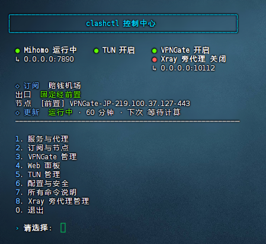

<h1 align="center">Clash for Linux · VPNGate</h1>

<p align="center"><strong>基于 Mihomo 的订阅代理与 VPNGate 出口管理工具</strong></p>

<p align="center">
无需额外安装 OpenVPN、Python 服务或 Docker，安装完成后统一通过
<code>clashctl</code> 控制中心管理。
</p>

<p align="center">
  
</p>

<p align="center"><sub>clashctl 控制中心</sub></p>

---

本项目基于 [`clash-for-linux-install`](https://github.com/nelvko/clash-for-linux-install) 二次开发，使用 Mihomo 原生 OpenVPN
出站。前置订阅负责访问 VPNGate API，以及连接部分无法直连的中继服务器。

| 功能 | 说明 |
| --- | --- |
| 统一控制中心 | 订阅、节点、TUN、VPNGate 和定时更新统一管理 |
| 双链路出口 | 支持 VPNGate 直连、经前置和智能自动 |
| 可视化操作 | 内置 Zashboard 3.25.0，可测速、选节点和切换出口 |

> [!IMPORTANT]
> 本文只介绍首次安装和基本使用。安装完成后运行 `clashctl`，其他常用功能
> 和命令都可以直接从控制中心查看。

## 快速导航

- [安装](#一安装)
- [导入前置订阅](#二导入前置订阅)
- [打开 Zashboard](#三打开-zashboard-面板)
- [启用 VPNGate](#四启用-vpngate)
- [切换 VPNGate 出口](#五在哪里切换-vpngate)

---

## 一、安装

> 推荐使用 **Debian/Ubuntu**，并确保系统支持 `/dev/net/tun`。

### 一键安装（推荐）

直接复制下面整段命令执行，无需提前修改端口或其他配置：

```bash
git clone --branch main --depth 1 https://gh-proxy.com/https://github.com/wangh00/clash-for-linux-install-vpngate.git \
  && cd clash-for-linux-install-vpngate \
  && bash install.sh
```

如果 `gh-proxy.com` 无法使用，可以改用备用镜像：

```bash
git clone --branch main --depth 1 https://ghfast.top/https://github.com/wangh00/clash-for-linux-install-vpngate.git \
  && cd clash-for-linux-install-vpngate \
  && bash install.sh
```

默认安装配置：

- 内核：Mihomo；
- 安装目录：`~/clashctl`；
- 局域网 HTTP/SOCKS5 共用端口：`7890`；
- 监听地址：`0.0.0.0`；
- 代理用户名：`vpngate`；
- 代理密码：安装时随机生成；
- 初始订阅：留空，安装后从 `clashctl` 控制中心添加。

### 可选：安装前自定义

只有需要修改端口、账号或安装时自动导入订阅时，才需要执行：

```bash
cp .env.install .env.install.local
nano .env.install.local
bash install.sh
```

> 项目默认已配置 `CLASHCTL_KERNEL=mihomo`，不需要在命令后面再加
> `mihomo`。

安装完成后，让当前终端加载 `clashctl`：

```bash
source ~/.bashrc
```

然后打开控制中心：

```bash
clashctl
```

---

## 二、导入前置订阅

如果已经在 `.env.install.local` 中填写了 `CLASHCTL_SUB_URL`，安装时会自动导入，
可以跳过本节。

否则进入控制中心：

```text
clashctl
└─ 2. 订阅与节点
   └─ 2. 添加订阅
```

根据提示依次填写：

1. 订阅链接；
2. 订阅名称；
3. 下载代理 URL；
4. 是否添加后立即启用。

> 订阅可以直接访问时，“下载代理 URL”直接回车即可。

如果订阅只能通过局域网已有代理下载，可以填写例如：

```text
http://192.168.1.100:7890
```

添加完成后，进入“订阅与节点”里的“选择策略组节点”，或者打开 9090 面板，
先选一个能够正常上网的订阅节点。

---

## 三、打开 Zashboard 面板

进入：

```text
clashctl
└─ 4. Web 面板
   └─ 1. 显示 Zashboard 地址和密钥
```

也可以直接执行：

```bash
clashctl ui
```

局域网访问地址通常是：

```text
http://服务器IP:9090/ui/
```

例如服务器 IP 是 `192.168.1.18`：

```text
http://192.168.1.18:9090/ui/
```

> 首次进入时，按照 `clashctl` 输出填写 Controller 地址和密钥。

---

## 四、启用 VPNGate

### 1️⃣ 选择前置策略组

进入：

```text
clashctl
└─ 3. VPNGate 管理
   └─ 4. 查看/设置前置策略组
```

按序号选择平时用来切换订阅节点的策略组，例如“节点选择”。菜单使用序号，
不需要手动输入带 Emoji 的完整组名。

这里保存的是策略组本身。以后在 9090 中切换该组的订阅节点，VPNGate 的
经前置链路也会自动跟随。

### 2️⃣ 启用 VPNGate

进入：

```text
clashctl
└─ 3. VPNGate 管理
   └─ 5. 启用 VPNGate
```

首次使用建议国家代码直接回车，保持 `ALL`，导入全部有效节点。启用过程会
自动开启 TUN、通过前置订阅获取 VPNGate API，并生成直连和经前置两组节点。

启用后建议在“VPNGate 管理”中进入“定时更新管理”，启动默认 60 分钟的
自动更新，避免公共中继过期。

---

## 五、在哪里切换 VPNGate

### 方法一：在 clashctl 中切换

进入：

```text
clashctl
└─ 3. VPNGate 管理
   └─ 3. 选择出口模式
```

| 出口模式 | 行为 |
| --- | --- |
| **智能自动** | 直连优先，直连失败后使用经前置 |
| **固定直连** | 只使用 VPNGate 直连 |
| **固定经前置** | 建立 VPNGate 连接时固定经过前置订阅 |

### 方法二：在 9090 面板中切换

启用 VPNGate 后，Zashboard 会显示 `VPNGate-直连` 和
`VPNGate-经前置` 两个分组。

使用方法：

- 点击备用组标题上的“点击切换到此链路”，可以把它设为当前出口；
- 直接点击备用组里的某个节点，也会选择节点并切换到该组；
- 当前固定组会显示绿色“当前出口·固定”；
- 点击绿色标记可以恢复“智能自动”；
- 每组第一项 AUTO 为自动选择，后面是全部可手动选择的 VPNGate 节点。

前置订阅节点仍然在原来的订阅策略组中切换；VPNGate 直连/经前置模式则在
上述两个 VPNGate 组中切换，两者不要混淆。

---

## 六、后续管理

以后只需要运行：

```bash
clashctl
```

即可从控制中心完成订阅更新、节点选择、VPNGate 状态查看、定时更新、日志、
综合诊断以及关闭 VPNGate 等操作。

---

<p align="center"><strong>安装一次，后续统一使用 <code>clashctl</code> 管理。</strong></p>
